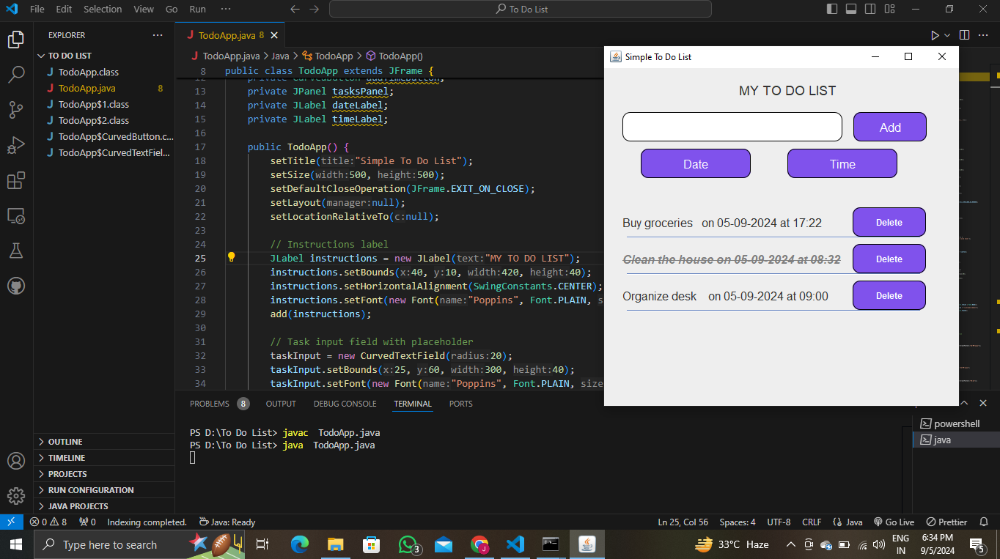

# Simple To-Do List ✅

A straightforward and stylish To-Do List application built using Java Swing, featuring custom-designed curved buttons and input fields.

## Features

- **Custom Design**: Curved input fields and buttons for a modern, sleek look.
- **Task Management**: Add, delete, and mark tasks as completed with ease.
- **Date and Time Selection**: Choose a specific date and time for each task.
- **Interactive GUI**: Intuitive interface for easy task management.

## How to Use

1. **Run the Program**: Launch the application to open your To-Do List.
2. **Add a Task**: Type a task in the input field and click the "Add" button to add it to the list.
3. **Choose Date and Time**: Use the "Date" and "Time" buttons to select when the task is due.
4. **Mark as Completed**: Click on a task to strike it through, indicating it’s completed.
5. **Delete a Task**: Click the "Delete" button next to a task to remove it from the list.

## Screenshots



## How to Run

1. **Compile the Program**:

    ```bash
    javac TodoApp.java
    ```

2. **Run the Program**:

    ```bash
    java TodoApp
    ```

## Custom Components

- **CurvedTextField**: Custom JTextField with rounded corners for smooth input.
- **CurvedButton**: JButton with curved edges for a modern aesthetic.

## Dependencies

- Java (JDK 8 or later)

## Contributing

Feel free to fork this repository, create a feature branch, and submit a pull request. Contributions are welcome!
